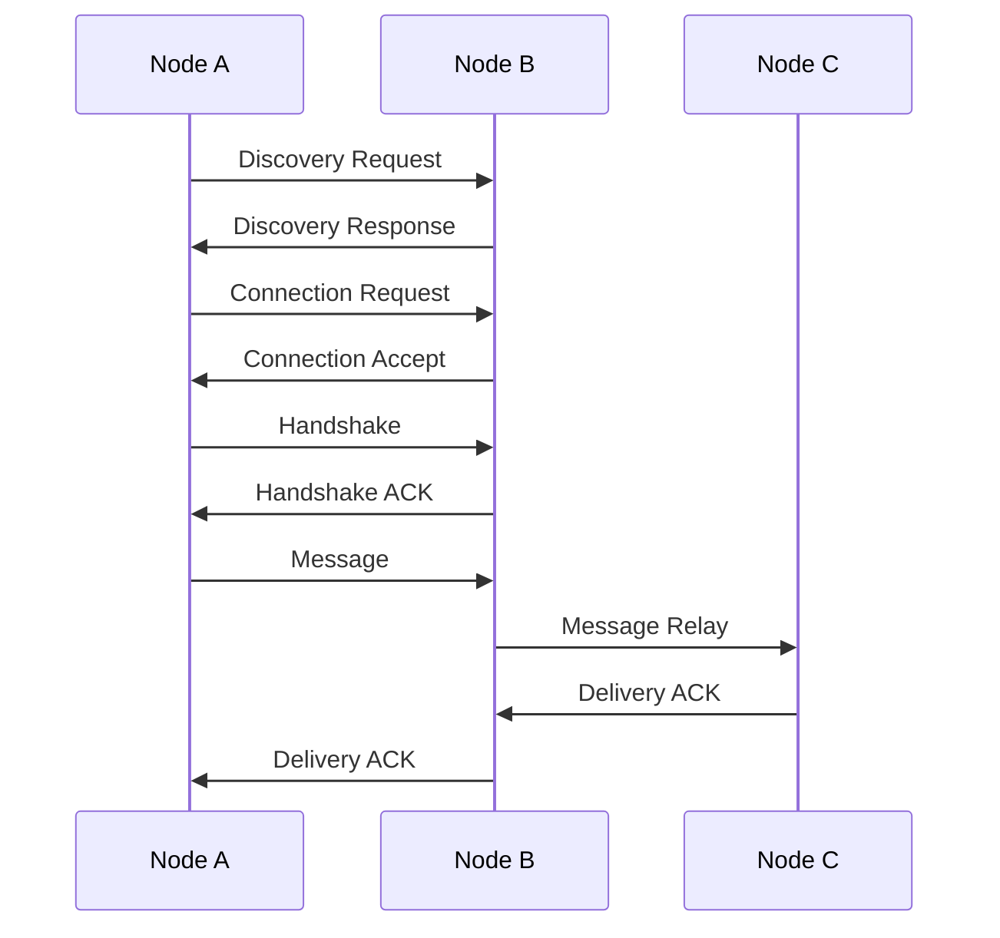
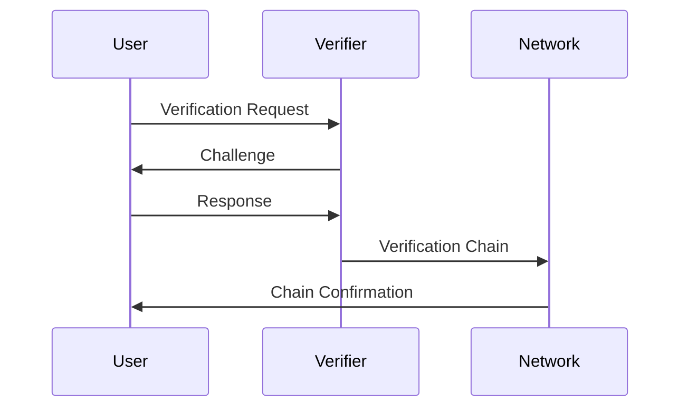
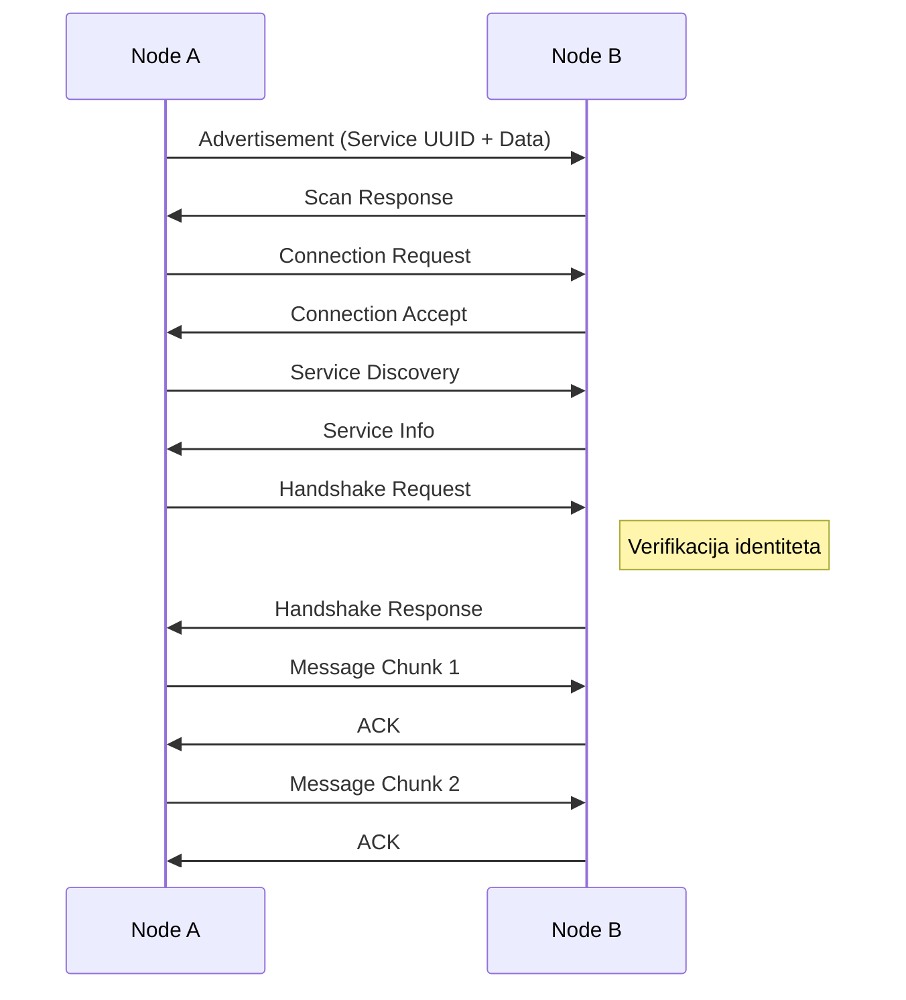

# Glasnik - Arhitektura Sistema

## Pregled Sistema

Glasnik je decentralizovana mesh komunikaciona aplikacija koja omogućava sigurnu razmenu poruka bez oslanjanja na centralni server. Aplikacija koristi P2P mrežu za komunikaciju i implementira napredne sigurnosne mehanizme.

## Arhitekturni Principi

1. **Decentralizacija**
   - Nema centralnog servera
   - P2P komunikacija
   - Distribuirano rutiranje poruka

2. **Sigurnost**
   - End-to-end enkripcija
   - Forward secrecy
   - Zero-knowledge proof verifikacija
   - Secure storage

3. **Skalabilnost**
   - Modularni dizajn
   - Lazy loading
   - Efikasno korišćenje resursa

## Komponente Sistema

### 1. Network Layer
```
lib/features/network/
├── data/
│   └── repositories/
│       ├── mesh_network_repository.dart
│       └── bluetooth_repository.dart
├── domain/
│   ├── entities/
│   │   ├── peer.dart
│   │   └── message.dart
│   └── repositories/
│       ├── mesh_network_repository.dart
│       └── bluetooth_repository.dart
└── presentation/
    └── blocs/
        ├── network_bloc.dart
        └── bluetooth_bloc.dart
```

### 2. Auth Layer
```
lib/features/auth/
├── data/
│   └── repositories/
│       └── auth_repository.dart
├── domain/
│   ├── entities/
│   │   └── user.dart
│   └── repositories/
│       └── auth_repository.dart
└── presentation/
    ├── blocs/
    │   └── auth_bloc.dart
    └── pages/
        └── auth_page.dart
```

### 3. Messaging Layer
```
lib/features/messaging/
├── data/
│   └── repositories/
│       └── message_repository.dart
├── domain/
│   ├── entities/
│   │   ├── message.dart
│   │   └── conversation.dart
│   └── repositories/
│       └── message_repository.dart
└── presentation/
    ├── blocs/
    │   └── messaging_bloc.dart
    └── pages/
        ├── conversations_page.dart
        └── chat_page.dart
```

### 4. Security Layer
```
lib/features/security/
├── data/
│   └── repositories/
│       ├── encryption_repository.dart
│       └── verification_repository.dart
├── domain/
│   ├── entities/
│   │   ├── verification_chain.dart
│   │   └── security_config.dart
│   └── repositories/
│       ├── encryption_repository.dart
│       └── verification_repository.dart
└── utils/
    ├── crypto_utils.dart
    └── security_utils.dart
```

## Komunikacioni Protokoli

### 1. Mesh Network Protocol


### 2. Verification Protocol


## Bluetooth Komunikacija

### 1. BLE Protokol


### 2. GATT Servisi
```
Service UUID: 6E400001-B5A3-F393-E0A9-E50E24DCCA9E
├── TX Characteristic (6E400002-...)
│   └── Properties: Write, WriteWithoutResponse
└── RX Characteristic (6E400003-...)
    └── Properties: Read, Notify
```

### 3. Advertisement Data
```json
{
  "localName": "Glasnik Node",
  "txPowerLevel": -59,
  "manufacturerData": {
    "protocolVersion": 1,
    "nodeType": 0,
    "batteryLevel": 0,
    "networkStatus": 0
  }
}
```

### 4. Handshake Protokol
1. **Inicijalizacija**
   - Generisanje session key-a
   - Priprema capabilities
   - Digitalno potpisivanje

2. **Razmena Podataka**
   ```json
   {
     "version": "1.0",
     "publicKey": "...",
     "nodeType": "regular",
     "timestamp": "2024-...",
     "capabilities": {
       "maxMessageSize": 1048576,
       "supportedTypes": ["text", "system", "verification"],
       "protocolVersion": "1.0",
       "canRelay": true
     },
     "signature": "..."
   }
   ```

3. **Verifikacija**
   - Provera potpisa
   - Validacija capabilities
   - Uspostavljanje sigurne veze

### 5. Message Chunking
```
[Header (4B)] [Payload (≤508B)]
│            └── Chunk Data
└── Index (1B) + Total (1B) + Size (2B)
```

### 6. Optimizacije
1. **Potrošnja Baterije**
   - Adaptive scanning intervals
   - Low power mode
   - Optimizovan TX power level

2. **Bandwidth**
   - Message chunking
   - MTU optimizacija
   - Flow control

3. **Mesh Networking**
   - Dijkstra routing
   - Max 3 hops
   - Route caching

### 7. Sigurnost
1. **Enkripcija**
   - End-to-end encryption
   - Session keys
   - Forward secrecy

2. **Autentikacija**
   - Digital signatures
   - Handshake verification
   - Capability negotiation

3. **Integritet**
   - Message signatures
   - Chunk verification
   - Replay protection

### 8. Error Handling
1. **Reconnection**
   - Automatic retry
   - Exponential backoff
   - Connection persistence

2. **Data Recovery**
   - Chunk reassembly
   - Missing chunk detection
   - Corruption detection

3. **Timeout Handling**
   - Connection timeout
   - Operation timeout
   - Handshake timeout

### 9. Monitoring
1. **Metrics**
   - Signal strength (RSSI)
   - Battery level
   - Connection quality

2. **Diagnostics**
   - Connection stats
   - Error rates
   - Latency measurement

### 10. Ograničenja
1. **Hardware**
   - BLE 4.0+ required
   - Limited range (~10m)
   - MTU size (20-512 bytes)

2. **Software**
   - Max message size: 1MB
   - Max hops: 3
   - Max peers: Platform dependent

3. **Performance**
   - Latency: ~50ms per hop
   - Throughput: ~10KB/s
   - Battery impact: ~5%/hour

## Sigurnosni Model

### 1. Enkripcija
- AES-256 za simetrično šifrovanje
- RSA-4096 za asimetrično šifrovanje
- ChaCha20-Poly1305 za stream enkripciju
- X25519 za key exchange

### 2. Verifikacija
- QR kod verifikacija
- Zvučna verifikacija
- Biometrijska verifikacija
- Verifikacioni lanci

### 3. Secure Storage
- Encrypted SQLite baza
- Secure enclave za ključeve
- Secure memory handling

## Performanse

### 1. Optimizacije
- Lazy loading komponenti
- Efikasno rutiranje poruka
- Kompresija podataka
- Batch processing

### 2. Resursi
- Minimalna potrošnja baterije
- Optimizovano korišćenje memorije
- Efikasno korišćenje mreže

## Deployment

### 1. Build Process
- Flutter build optimizacije
- Asset optimizacije
- Code minification

### 2. Distribution
- Google Play Store
- Apple App Store
- F-Droid
- Direct APK

## Monitoring i Održavanje

### 1. Logging
- Error tracking
- Performance monitoring
- Usage analytics

### 2. Updates
- In-app updates
- Security patches
- Feature rollouts

## Roadmap

### Kratkoročni Ciljevi
1. Implementacija osnovne mesh mreže
2. Implementacija verifikacionog sistema
3. Implementacija messaging sistema

### Dugoročni Ciljevi
1. Proširenje mesh mreže
2. Dodatne sigurnosne feature
3. Optimizacija performansi
4. Internacionalizacija 